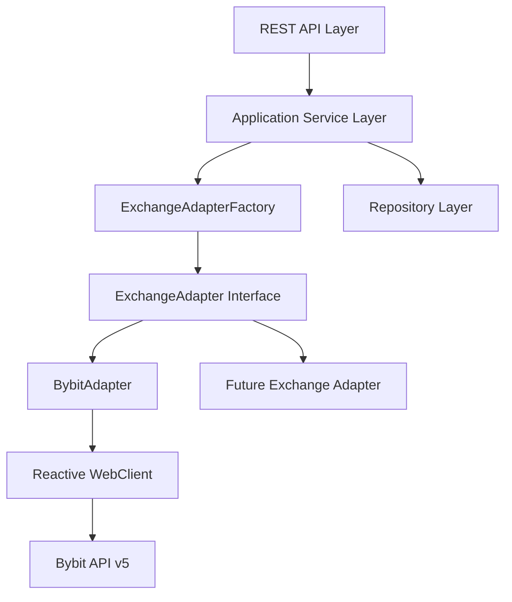

# Architecture Decision Record: Exchange Integration Strategy

## Context

The primary goal of the system is to support Bybit Spot Exchange initially, with the architectural flexibility to add other exchanges (Binance, Kraken, etc.) in the future without modifying core business logic.

## Decision: Adapter Pattern with Reactive WebClient

We have implemented an exchange-agnostic architecture using the **Adapter Pattern**.

### Architecture Overview

### Key Components

1.  **`ExchangeAdapter` Interface**: Defines the contract for all exchange operations (balances, orders, trade history).
2.  **`ExchangeAdapterFactory`**: Dynamically provides the correct adapter based on the user's selected exchange.
3.  **Domain Models**: Clean models (`Order`, `Balance`) that are independent of exchange-specific DTOs.
4.  **Reactive Core**: All exchange communication uses Project Reactor (`Mono`, `Flux`) to handle the inherently asynchronous and I/O-bound nature of trading.

## Security: API Key Protection

To ensure the security of user exchange credentials:

1.  **AES-256-GCM Encryption**: Credentials are encrypted before database persistence.
2.  **Secret Management**: The master encryption key is never committed to code and MUST be provided via environment variables or a secure key vault.
3.  **No Custody**: The system never handles user private keys or wallet seeds, reducing security surface area.

## Data Consistency

1.  **Transactional Integrity**: Service-layer methods are marked with `@Transactional` to ensure atomicity between database operations and exchange interactions (where applicable).
2.  **Dual Storage**: Orders are persisted locally for historical tracking and UI responsiveness, while the exchange remains the source of truth for execution status.
